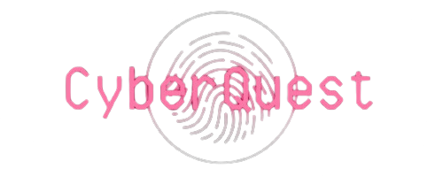

  

# CyberQuest - Jogo Educativo em Cibersegurança

## Sobre o Jogo
O CyberQuest é um jogo educacional desenvolvido como parte da disciplina Projeto Interdisciplinar para Sistemas de Informação I. O jogo tem como objetivo educar os jogadores sobre conceitos fundamentais de cibersegurança, proporcionando uma experiência interativa e desafiadora.
 
## Funcionalidades
- **Quiz de Cibersegurança (Fase 1):** Teste seus conhecimentos respondendo a perguntas sobre cibersegurança com um quiz rápido.
- **Cifra de César (Fase 2):** Enfrente o desafio de criptografar mensagens usando a cifra de César.
- **Estudo de Caso (Fase 3):** Tome decisões estratégicas em um cenário envolvente de cibersegurança.

## Como Jogar
1. **Começo:**
   - Execute o arquivo principal: `cyberquest.py`.
   - Certifique-se de ter o Python e as bibliotecas necessárias instaladas.

2. **Interface Gráfica:**
   - Ao iniciar, a tela inicial será exibida. Clique em "Começar" para iniciar o jogo.

3. **Fases do Jogo:**
   - O jogo consiste em três fases, cada uma com desafios específicos.
   - Responda a perguntas, decifre mensagens e tome decisões estratégicas.

4. **Vitória ou Derrota:**
   - Com base em suas escolhas e desempenho, você pode vencer ou perder o jogo.
   - A tela de resultado mostrará seus resultados e oferecerá a opção de jogar novamente.

## Requisitos do Sistema
- Python 3.x
- Kivy
- KivyMD